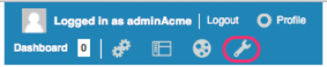
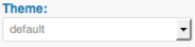
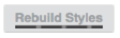
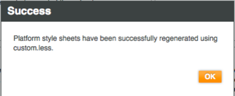
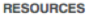
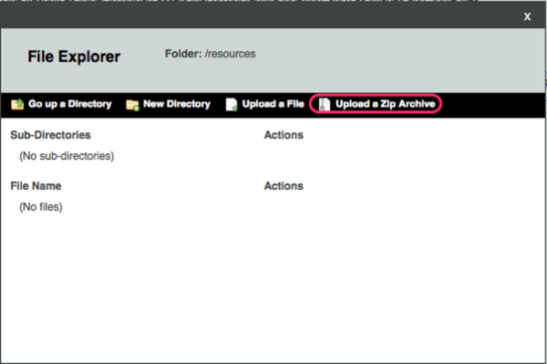
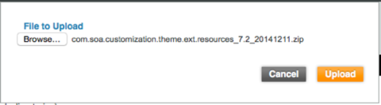
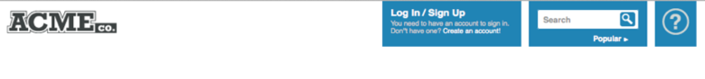
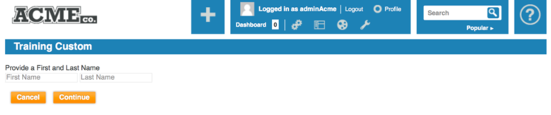
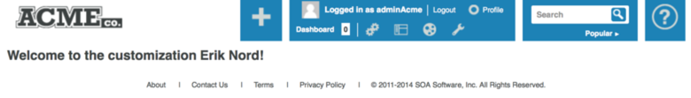

#SOA Software Community Manager&reg; Customization Guide for verison 7.2

##Default Theme

###Branding

####Background, technologies
Custom less
*[http://lesscss.org](https://www.google.com)

####Customize custom.less

#####Download custom.less
1.  Log into system as administrator (http(s)://<hostname>:<port>/enterpriseapi/)
2.  Click on the administration wrench in the header<br/>
 
3.  Click on the   option in the left navigation panel
4.  Validate that the default theme is selected in the Theme: drop down.<br/>
 
5.  Under the Download box, click on the  button.
6.  Save the file to the less file in the folder structure that was created during set-up.
7.  Verify the downloaded file is named custom.less.

#####Upload and Rebuild Styles
1.  Log into system as administrator (http(s)://<hostname>:<port>/enterpriseapi/)
2.  Click on the administration wrench in the header<br/>
 
3.  Click on the  option in the left navigation panel
4.  Validate that the default theme is selected in the Theme: drop down.<br/>
 
5.  Under the Upload box, click on the  button.
6.  Click on the Browse button.
7.  Browse to the location of the modified custom.less file, select it and click the Open button.
8.  Click on the Upload button.
9.  This will automatically kick off a rebuild of the styles.<br/>
 
10. Click the OK button once everything successfully builds.<br/>
 
11. Either clear out the browser cache, open a private (incognito) window or a new browser all together, and validate the changes are properly displaying.

#####Update Company Logo
1.  Copy company_logo.png to ‘resources/theme/default/images’.
2.  Change the following code in ‘less/custom.less’
```css
// top left logo image path
// @logo-img: url("images/logo_50.png");
@logo-img: url("/resources/images/company_logo.png");
```
3.  Save the custom.less file.
4.  Zip up the file directory under the resources folder<br/>
5.  Log into the default theme as administrator (http(s)://<hostname>:<port>/enterpriseapi)
6.  Click on the administration wrench in the header.
 
7.  Click on the  option in the left navigation panel<br/>
8.  Click on the  link.<br/>
9.  Under the Resources section, click on the File Manager button.
 
10. Click on Upload a Zip Archive.<br/>
 
11. Browse to the zip file, select it and click on the Open button.
12. Click on the Upload button.<br/>
 
13. Click on the   button to close the CMS window.
14. Click on the   link from the left navigation
15. Validate that the default theme is selected in the Theme: drop down.<br/>
 
16. In the Rebuild Styles box, click on the Rebuild Styles button.
17. Either clear out the browser cache, open a private (incognito) window or a new browser all together, and validate that the new company logo is properly displaying.
 

#####Text, Font, Colors

####Custom Properties

###Content

####Customize Landing Page
1.  Create index.htm under the landing folder content
2.  Build the proper view
3.  Bundle up the content directory as a zip file
4.  Log into the Community Manager portal
5.  Select the administration wrench
6.  In the left nav, click on the Config link.
7.  Click on the Resources link.
8.  Under Content select the File Manager link
9.  Click on the Upload button.
10. Test the new content that was uploaded

####Customize supplied Documentation
1.  Log into the Community Manager portal
2.  Select the administration wrench
3.  In the left nav, click on the Config link.
4.  Click on the Resources link.
5.  Under Content, select the File Manager link.
6.  Scroll down to index.htm and to the right click to the View Direct link.
Note: this will download a copy of this file to the download location on your computer.
7.  Copy this new file to the correct folder structure.
8.  Update this file as needed.
9.  Bundle up the content directory as a zip file
10. Log into the Community Manager portal
11. Select the administration wrench
12. In the left nav, click on the Config link
13. Click on the Resources link.
14. Under Content, select the File Manager link
15. Click on Upload a Zip Archive
16. Browse to the archive that was created above
17. Click on the Upload button.
18. Test the new content that was uploaded.

###Resource

####Widget Customization 

#####metadata.json
metadata.json is the json file that is used to create the layout of the Community Manager.  This file is discussed in detail at: [http://docs.soa.com/cm/share/cm_customizing_ui.htm#customization_architecture](http://docs.soa.com/cm/share/cm_customizing_ui.htm#customization_architecture)
A user will need to know how to get the default layout of a page.  This is then copied into a custom metadata.json.  Going to a page in the Community Manager portal, which will display the default metadata.json, can retrieve the default layout.  
1.  Open Developer tools.  
2.  Under the elements you will see a URL that retrieves the CSS.  You need to copy the value after ‘/atmosphere/’ and before ‘/resources/’.  It will be something like ‘/_VWnugUiabgQcfcBxZh4Iv8Q’.  You will need to take this value and add it to the following url:
Foo
3.  Tenant is the name of the deployed tenant.  This url will return the default metadata.json.  
4.  Search this document for the view that needs to be modified.  
5.  Copy this view into the customized metadata.json.

#####Modify Existing Widget
1.  Create a new folder under the widgets folder called FooterWidget
2.  In the FooterWidget folder, create a new file called FooterWidget.impl.htm
3.  Customize the footer widget with the following code:
```javascript
<script id="FooterWidgetTemplate" type="text/x-jQuery-tmpl">
    <ul class="footerNav clearthis">
        <li>
            <a id="footerHome"  href="#/home/landing">Home</a>
        </li>
        <li>
            <a id="footerSupport" href="#/home/support">Support</a>
        </li>
        <li>
            <a id="footerTerms" href="http://<term/condition url>">Terms of Use</a>
        </li>
        <li>
            <a id="footerPrivacy" href="http://<privacy url>">Privacy Policy</a>
        </li>
        <li>
            <a id="footerSupport">{{{i18n "com.soa.atmosphere.footer.legal"}}}</a>
        </li>
    </ul>
</script>
```
4.  Validate Changes
5.  Log into the Community Manager portal
6.  Refresh cache
7.  Validate that the changes to the footer exist.

#####Add New Widget

####CanJS Customization

#####Add CanJS View
1.  Create the file structure DEMO → custom → views
2.  Add a file named custom_container.ejs into the view folder.
3.  The content of this file looks like the following:
<div <%= soa.framework.control("TEST.Home.Test.TestForm", this) %> class="soa-ui-cm-widget-wrapper">
</div>
4.  Create the view file by adding a file named custom.ejs into the view file
5.  The content of this file looks like the following:
```html
<div style="position: relative; overflow: hidden">
    <div id="inner" class="lens-scroll" style="width: 980px; padding-bottom: 60px;">
        <form id="TEST.Home.Test.TestForm" action="" method="get">
            <div class="ac-create-cont" id="ac-create-cont">
                <div class="rgt-pan bg-color">
                    <h1 id="profileFormHeading">Training Custom</h1>
                    <p id="profileFormBlurb"></p>
     
                    <div class="form-fields">
                        <ul class="WOB">
                            <li>Provide a First and Last Name</li>
                            <li>
                                <div style="clear:both;"></div>
                                <input name="firstName" class="required" id="firstName" type="text" placeholder="First Name">
                                <input name="lastName" class="required" id="lastName" type="text" placeholder="Last Name">
                            </li>
                        </ul>
                    </div> 
     
                </div>  
            </div>
            <div class="action-buttons">
                <button id="btnCancel" class="btn gb-sec-btn-small">Cancel</button>
                <button id="btnSubmit" class="btn gb-primary-btn-small">Continue</button>
            </div>
        </form>
    </div>
</div>
```
6.  Create the view file by adding a file named custom_summary.ejs into the views file.
7.  The content of this file looks like the following:
```html
<h2 id="welcomeStatement">Welcome to the customization <%== firstName %> <%== lastName %><% console.log(this) %>!</h2>
```
8.  Create the controller, custom.js, in the custom folder.
9.  Add the following code to the custom.js file.
```javascript
steal(function () {
    can.getObject("TEST.Home.Test.TestForm", window, true);
    TEST.Home.Test.TestForm = SOA.Console.BaseControl(
        /* @Static */
        {
            "defaults" : {}
        },
        /* @Prototype */
        {
            "display" : function() {
                console.log("In custom.js display() Enter >>>");

                var thisControl = this;

                thisControl.options.member = {};

                var deferred = SOA.Console.Models.Tenant.cacheDeepOne();
                deferred.then(function (tenant) {
                    SOA.Framework.Common.WidgetFactory.draw("trainingCustomForm", {}, thisControl.element);
                });

                console.log("In custom.js display() Exit >>>");
            },
            "#btnSubmit click" : function(element, event) {
                console.log("In custom.js #btnSubmit click() Enter >>>");
                
                event.preventDefault();
                var thisControl = this;

                var formParams = thisControl.element.formParams();
                console.log(formParams);
                console.log(formParams.firstName);
                console.log(formParams.lastName);

                SOA.Framework.Common.WidgetFactory.draw("trainingCustomSummaryForm", formParams, thisControl.element);

                // The following line can also be used to transfer to new screen, when using this it requires the page to
                //      be defined in metadata.json
                //window.location.hash = "#/home/customSummary";
                
                console.log("In custom.js #btnSubmit click() Exit >>>");
            }
        }
    );
    return TEST.Home.Test.TestForm;
});
```
10. Create the file structure of SOA → CM → extensions.
11. Create the widget_factory.json into the extensions directory.
12. Add the following code into this file.
```json
{
    "trainingCustomFormContainer" : {
        "widgets": [
            {
                "position": "html",
                "view": "COMPANY/custom/views/custom_container.ejs"
            }
        ]
    },
    "trainingCustomForm": {
        "widgets": [
            {
                "position": "html",
                "view": "COMPANY/custom/views/custom.ejs"
            }
        ]
    },
    "trainingCustomSummaryForm": {
        "widgets": [
            {
                "position": "html",
                "view": "COMPANY/custom/views/custom_summary.ejs"
            }
        ]
    }
}
```
13. Validate all JSON by using something like [http://jsonlint.com](http://jsonlint.com)
17. Create the file metadata.json into the extensions directory.
18. Add the following code into the metadata.json file
```json
{
    "layoutStructure": [
        {
            "objType": "home",
            "view": "custom",
            "scriptResources": [
                "/resources/theme/default/COMPANY/custom/custom.js"
            ],
            "layout": [
                {
                    "widgetInstance": "Main",
                    "widget": "widget.horiz.tiling",
                    "priority": "100"
                },
                {
                    "widgetInstance": "Header",
                    "widget": "widget.header",
                    "parentWidgetInstance": "Main",
                    "parent": "widget.horiz.tiling",
                    "priority": "1000"
                },
                {
                    "widgetInstance": "Content-Widest",
                    "widget": "widget.horiz.tiling",
                    "parentWidgetInstance": "Main",
                    "parent": "widget.horiz.tiling",
                    "priority": "2200"
                },
                {
                    "widgetInstance": "soa-control-cm-training-custom-widget",
                    "widget": "widget.iconsole.adapter",
                    "parentWidgetInstance": "Content-Widest",
                    "parent": "widget.horiz.tiling",
                    "priority": "2201",
                    "properties": {
                        "widgetKey": "trainingCustomFormContainer"
                    }
                },
                {
                    "widgetInstance": "Footer",
                    "widget": "widget.footer",
                    "parentWidgetInstance": "Main",
                    "parent": "widget.horiz.tiling",
                    "priority": "3000"
                }
            ]
        }
    ]
}
```
19. Validate 
23. Log into the Community Manager portal
24. Refresh cache
25. Validate that the changes by going to ‘../home/custom/’
26. Should see a page that looks something like below:
 
27. Enter the a First and Last name and click on the   button.  You will see the following screen:
 
28. Download the code:
Reference: [http://docs.soa.com/cm/share/cm_customizing_ui.htm#adding_new_views_or_widgets](http://docs.soa.com/cm/share/cm_customizing_ui.htm#adding_new_views_or_widgets)


