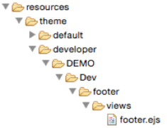

#SOA Software Community Manager&reg; Customization Guide for verison 7.2

##Developer Theme

###Branding

####Background, technologies
Custom less
•   [http://lesscss.org](http://lesscss.org)

####Customize custom.less

#####Download custom.less
1.  Log into system as administrator (http(s)://<hostname>:<port>/enterpriseapi/)
2.  Click on the administration wrench in the header
 
3.  Click on the  option in the left navigation panel
4.  Switch to the developer theme in the Theme: drop down.
 
5.  Under the Download box, click on the  button.
6.  Save the file to the less file in the folder structure that was created during set-up.
7.  Verify the downloaded file is named custom.less.

#####Upload and Rebuild Styles
1.  Log into system as administrator (http(s)://<hostname>:<port>/enterpriseapi/)
2.  Click on the administration wrench in the header
 
3.  Click on the  option in the left navigation panel
4.  Validate that the default theme is selected in the Theme: drop down.
 
5.  Under the Upload box, click on the  button.
6.  Click on the Browse button.
7.  Browse to the location of the modified custom.less file, select it and click the Open button.
8.  Click on the Upload button.
9.  This will automatically kick off a rebuild of the styles.
 
10. Click the OK button once everything successfully builds.
 
11. Either clear out the browser cache, open a private (incognito) window or a new browser all together, and validate the changes are properly displaying.

#####Update Company Logo
1. Copy company_logo.png to ‘resources/theme/default/images’.
2. Change the following code in ‘less/custom.less’
```css
/* the location of the logo image file */
//@logo-img-url: url(images/logo_228x60.png);
@logo-img-url: url(/resources/images/company_logo.png);
```
3. Save the custom.less file.
4. Zip up the file directory under the resources folder
5. Log into the default theme as administrator (http(s)://<hostname>:<port>/enterpriseapi)
6. Click on the administration wrench in the header.
 
7. Click on the  option in the left navigation panel
8. Click on the  link.
9. Under the Resources section, click on the File Manager button.
 
10. Click on Upload a Zip Archive.
 
11. Browse to the zip file, select it and click on the Open button.
12. Click on the Upload button.
 
13. Click on the  button to close the CMS window.
14. Click  on the  link from the left navigation
15. Validate that the default theme is selected in the Theme: drop down.
 
16. In the Rebuild Styles box, click on the Rebuild Styles button.
17. Either clear out the browser cache, open a private (incognito) window or a new browser all together, and validate that the new company logo is properly displaying.
 

#####Text, Font, Colors

####Custom Properties

###Content

###Resource

####Background, technologies
CanJS
•   [http://canjs.com](http://canjs.com)
JQuery
•   [http://jquery.com](http://jquery.com)

####Creating new views
To add new view, the following process should be followed:
1.  Write the CanJS view, controller and optional model
2.  Create a zip file with the folder structure defined above
3.  Upload the zip file into the CMS

####Modify existing views
Any view that is currently in SimpleDev can be overridden.  Here is a list of all existing views:

--- | --- | --- 
active_discussions | api_status | app_details
app_form | app_license_monitor | app_list
app_monitor_metrics | app_monitor_usage_by_api | app_oauth_form
app_overview | app_page | app_performance_chart
app_transaction_log | app_usage_by_api | avatar_uploader
base_control | common | config
discussion_details | discussion_form | discussion_list
document_viewer | extensions | file_upload_form
footer | forum | header
layout | locales | login
nav | packages | plugins
quick_links | recent_discussions | refresh
reset_password_form | search | search_filter
signup_activation | sub_nav | ticket_details
ticket_form | ticket_list | toc
user_profile | user_profile_details | user_profile_page
user_profile_password | user_profile_security | user_profile_settings
user_tools | |
 
#####Footer
Most customization start with updating the footer, and changing it to a company specific footer.  The footer can be replaced by adding a new ejs view to the customized folder, ‘DEMO -> Dev.  A new directory would need to be named footer, with a folder inside of this directory called views.  A new footer.ejs file would be added to this directory.
 
The ejs file becomes the new view of the footer.  An example of a new footer view would be:
```html
<link href="/resources/theme/developer/Demo/Dev/footer/views/social-buttons.css" rel="stylesheet">

<div class="soa-ui-cm-footer soa-cm-custom-center">
    <div class="container">
        <div class="row">
            <ul>
                <li>
                    <a href="https://www.facebook.com/SOASoftware" class="sb circle gradient glossy embossed blue facebook">
                        ::before
                        "Facebook"
                        ::after
                    </a>
                    <a href="https://www.facebook.com/SOASoftware" class="sb circle gradient glossy embossed blue twitter">
                        ::before
                        "Twitter"
                        ::after
                    </a>
                    <a href="https://www.facebook.com/SOASoftware" class="sb circle gradient glossy embossed blue linkedin">
                        ::before
                        "Linked In"
                        ::after
                    </a>
                    <a href="https://www.facebook.com/SOASoftware" class="sb circle gradient glossy embossed blue rss">
                        ::before
                        "RSS"
                        ::after
                    </a>
                </li>
            </ul>
        </div>
        <div class="row">
            <ul>
                <li>
                    Contact
                </li>
                <li>
                    <%== soa.framework.globalize("messages.companyName") %> <br/>
                    <%== soa.framework.globalize("messages.companyAddress") %> <br/>
                    <%== soa.framework.globalize("messages.companyPhone") %> <br/>
                </li>
                <li>
                    <a href="mailto:<%== soa.framework.globalize("messages.companyEmail") %>">Email</a>
                </li>
            </ul>
        </div>
        <div class="row">
            <ul>
                <li>
                    @ 2013 <%== soa.framework.globalize("messages.companyName") %> All rights reserved
                </li>
                </li>
            </ul>
        </div>
    </div>
</div>
```
Upload the new footer to the environment and test:
   
   
#####Header

####Helper Objects
soa.cm.alert
•   ‘alert’ is a box that can be dismissed that delivers feedback to the user
•   Implementation
```javascript
<%== soa.cm.alert({
"type" : "error",
    "messages": [
             "Hello world"
],
"classes" : "soa-ui-cm-example soa-ui-cm-example2",
"close" : true
}) %>
```
soa.cm.borderlessbutton
•   ‘borderlessbutton’ is a button that looks like an image, normally used when the class exists in the stylesheet
•   Implementation
```javascript
<%== soa.cm.borderlessButton({
"innerClasses" : "soa-ui-cm-img-txt soa-ui-cm-icon-imgtxt-thumb-neutral",
    "name" : "Thumbs up"
})%>
```
soa.cm.card
•   `card` is a set of HTML elements that display information neatly on a presentable card. This card can contain a title, a subtitle, a legend (containing multiple elements), and a description, as well as an image of the subject of information ("avatar")
•   Implementation
```javascript
<%== soa.cm.card({
    "avatarUrl" : "/path/to/img.png",
    "description" : "This app is the most useful epic in the known universe",
    "title" : "Epic App",
    "legend": soa.cm.status({"status": "Public"}) + " " + soa.cm.rating({"rating": 5}),
    "url" : "#!url"
}) %>
```
soa.cm.checkboxCollectionFormRow
•   `checkboxCollectionFormRow` is a set of HTML objects that can contain at least one checbkox input element, helper text, and a tooltip. They are enclosed in a UL element, enclosed by a DIV.
•   Implementation
```javascript
<%== soa.cm.checkboxCollectionFormRow({
    "name" : "ApplicationVersionVisibility",
    "groupName" : "Visibility",
    "tooltipText" : "Your app's visibility will determine if users can search for your app",
    "selectedValues" : ["Public","Limited"],
    "checkboxOptions" : [
        {
            "label" : "Public",
            "value" : "Public"
        },
        {
            "label" : "Private",
            "value" : "Limited"
        }
    ]
})%>
```
soa.cm.checkBoxFormRow
•   `checkBoxFormRow` is a set of HTML objects that can contain a text input element, helper text, and a tooltip. It is enclosed in a paragraph.
•   Implementation
```javascript
<%== soa.cm.checkBoxFormRow({
    "name" : "AcceptedAgreementID",
    "label" : "Terms and conditions accepted",
    "value" : "YES"
}) %>
```
soa.cm.contentButton
•   `contentButton` is a box that appears in the content area of the screen to inform the user of any errors
•   Implementation
```javascript
<%== soa.cm.contentButton({
"name" : "Export Credentials"
})%>
```
soa.cm.contentHeader
** TODO – ASK ARJUN **
soa.cm.emailTextBoxFormRow
•   ‘emailTextBoxFormRow’ is a set of HTML object that can contain a text input element, helper text, and a tooltip.  It is enclosed in a paragraph.  The field is required to be an email address.
•   Implementation
```javascript
<%== soa.cm.emailTextBoxFormRow({
"name" : "Email",
    "label" : "Email",
    "placeholder" : "Enter your email address",
    "value" : "email@email.com"
}) %>
```
soa.cm.enclosedTextBoxFormRow
•   `enclosedTextBoxFormRow` is a set of HTML objects that can contain a text input element, helper text, and a tooltip. It is enclosed in a paragraph
•   Implementation
```javascript
<%== soa.cm.enclosedTextBoxFormRow({
    "name" : "appid",
    "label" : "Application ID",
    "buttonName" : "Enter your application ID",
    "value" : "123456789"
}) %>
```
soa.cm.error
•   `error` is a box that can be dismissed that delivers feedback to the user regarding an error that occurred
•   Implementation
```javascript
<%== soa.cm.error({
"messages": [
        "Hello world"
    ],
    "classes" : "soa-ui-cm-example soa-ui-cm-example2"
}) %>
```
soa.cm.fileUploadFormRow
•   `fileUploadFormRow` is a set of HTML objects that can contain a file upload element, helper text, and a tooltip. It is enclosed in a paragraph.
•   Implementation
```javascript
<%== soa.cm.fileUploadFormRow({
    "name" : "avatar",
    "label" : "Avatar",
    "helperText": "Select an avatar to upload from your hard drive"
}) %>
```
soa.cm.formButton
•   `formButton` is a button that appears at the bottom of a form
•   Implementation
```javascript
<%== soa.cm.formButton({
"name": "Save"
}) %>
```
soa.cm.fromAndToDatePickersFormRow
•   `fromAndToDatePickersFormRow` is a set of HTML objects that can contain input elements that when clicked show a calendar. The user can pick dates from the calendar to show a "from" date and a "to" date and thus have a date range selected when complete.
•   Implementation
```javascript
<%== soa.cm.fromAndToDatePickersFormRow({
    "id":"soa-control-cm-txlogs-timeperiod",
    "label": "Time Period",
    "labelClasses":"soa-ui-cm-label-hidden",
    "fromName":"StartDate",
    "fromDisplayValue":"yyyy-mm-dd",
    "toLabel":"To",
    "toName":"EndDate",
    "toDisplayValue":"yyyy-mm-dd",
    "fromParams":{
        "dateFormat":"yy-mm-dd",
        "maxDate":new Date(),
        "onClose": function(fromDate){
            $("#soa-control-cm-txlogs-form #soa-control-cm-txlogs-timeperiod-to").datepicker( "option", "minDate", fromDate );
        }
    },
    "toParams":{
        "dateFormat":"yy-mm-dd",
        "minDate": new Date(),
        "maxDate":new Date()
    }
});%>
```
soa.cm.image
•   `image` is a part of an entire navigation bar and needs to be placed inside
•   Implementation
```javascript
<%== soa.cm.image({
    "url": "/path/to/image.png"
}) %>
```
soa.cm.imageAvatarWithName
•   `imageAvatarWithName` is an avatar image with a name underneath
•   Implementation
```javascript
<%== soa.cm.imageAvatarWithName({
"url": "/images/profile.png"
    "id" : "soa-control-cm-avatar",
    "name" : "John Smith",
}) %>
```
soa.cm.imageAvatarWithTag
•   `imageAvatarWithTag` is an avatar image with a name underneath
•   Implementation
```javascript
<%== soa.cm.imageAvatarWithTag({
"url": "/images/profile.png"
    "name" : "John Smith",
}) %>
```
soa.cm.imageButton
•   `imageButton` is a button that looks like an image, normally used when the image is pulled from the database
•   Implementation
```javascript
<%== soa.cm.imageButton({
"name": "Will not appear",
    "imageURL" : "/images/facebook.gif",
    "title" : "Facebook" 
}) %>
```
soa.cm.imageUpload
•   `imageUpload` is an image with an optional upload button layered on top
•   Implementation
```javascript
<%== soa.cm.imageUpload({
"url": "/images/profile.png",
    "upload": true,
    "message" : "Upload a new avatar"
}) %>
```
soa.cm.imageUploadFormBox
** TODO – ASK ARJUN **
soa.cm.info
•   `info` is a box that can be dismissed that delivers feedback to the user regarding important information
•   Implementation
```javascript
<%== soa.cm.info({
"messages": [
        "Hello world"
    ],
    "classes" : "soa-ui-cm-example soa-ui-cm-example2"
}) %>
```
soa.cm.navItem
•   `navItem` is a part of an entire navigation bar and needs to be placed inside
•   Implementation
```javascript
<%== soa.cm.navItem({
"name": "Forum",
"url": "#!forum"
}) %>
```
soa.cm.informationBox
** TODO – ASK ARJUN **
soa.cm.licenseListItem
** TODO – ASK ARJUN **
soa.cm.newsAlert
•   `newsAlert` is a box that appears in the content area of the screen to inform the user of static errors or information
•   Implementation
```javascript
<%== soa.cm.newsAlert({
"type": "info",
    "text": "Hello world",
    "header" : "Alert!",
    "classes" : "soa-ui-cm-example soa-ui-cm-example2"
})%>
```
soa.cm.newsError
•   `newsError` is a box that appears in the content area of the screen to inform the user of any errors
•   Implementation
```javascript
<%== soa.cm.newsError({
"text": "Hello world",
    "header" : "Information",
    "classes" : "soa-ui-cm-example soa-ui-cm-example2"
})%>
```
soa.cm.newsInfo
•   `newsInfo` is a box that appears in the content area of the screen to inform the user of any important information
•   Implementation
```javascript
<%== soa.cm.newsInfo({
"text": "Hello world",
    "header" : "Information",
    "classes" : "soa-ui-cm-example soa-ui-cm-example2"
})%>
```
soa.cm.newsSuccess
•   `newsSuccess` is a box that appears in the content area of the screen to inform the user of a transaction success
•   Implementation
```javascript
<%== soa.cm.newsSuccess({
"text": "Hello world",
    "header" : "Success!",
    "classes" : "soa-ui-cm-example soa-ui-cm-example2"
})%>
```
soa.cm.newsWarning
•   `newsWarning` is a box that appears in the content area of the screen to inform the user of any warning information
•   Implementation
```javascript
<%== soa.cm.newsWarning({
"text": "Hello world",
    "header" : "Information",
    "classes" : "soa-ui-cm-example soa-ui-cm-example2"
})%>
```
soa.cm.numberTextBoxFormRow
•   ‘numberTextBoxFormRow’ is a set of HTML objects that can contain a text input element, helper text, and a toolitp.  It is enclosed in a paragraph.  The field is required to be a number.
•   Implementation
```javascript
<%== soa.cm.numberTextBoxFormRow({
    "name" : "age",
    "label" : "Age",
    "placeholder" : "Enter your Age",
    "value" : "10"
}) %>
```
soa.cm.pageButton
•   `pageButton` is a button that appears in the header area of the screen
•   Implementation
```javascript
<%== soa.cm.pageButton({
"name": "Export"
}) %>
```
soa.cm.pageTitle
•   `pageTitle` is the title of the page
•   Implementation
```javascript
<%== soa.cm.pageTitle({
"title": "My Apps"
}) %>
```
soa.cm.passwordFormRow
•   `passwordFormRow` is a set of HTML objects that can contain a password input element, helper text, and a tooltip. It is enclosed in a paragraph.
•   Implementation
```javascript
<%== soa.cm.passwordFormRow({
    "name" : "Password",
    "label" : "Password",
    "placeholder" : "Enter your password"
}) %>
```
soa.cm.plainLinkButton
•   `plainLinkButton` is a button that looks like a text link
•   Implementation
```javascript
<%== soa.cm.plainLinkButton({
"name": "Login"
}) %>
```
soa.cm.radioButtonsFormRow
•   `radioButtonsFormRow` is a set of HTML objects that can contain at least one radio button input element, helper text, and a tooltip. They are enclosed in a UL element, enclosed by a DIV.
•   Implementation
```javascript
<%== soa.cm.radioButtonsFormRow({
    "name" : "ApplicationVersionVisibility",
    "groupName" : "Visibility",
    "tooltipText" : "Your app's visibility will determine if users can search for your app",
    "selectedValue" : "Public",
    "radioOptions" : [
        {
            "label" : "Public",
            "value" : "Public",
            "inputId" : "soa-control-cm-appVisibility-public",
            "disabled" : false
        },
        {
            "label" : "Private",
            "value" : "Limited",
            "inputId" : "soa-control-cm-appVisibility-private",
            "disabled" : true
        },
        {
            "label" : "Registered Users",
            "value" : "com.soa.visibility.registered.users",
            "inputId" : "soa-control-cm-appVisibility-registered-users"
        }
    ]
})%>
```
soa.cm.rating
•   `rating` A small HTML element that displays a rating of 1-5 stars
•   Implementation
```javascript
<%== soa.cm.rating({
"rating" : 4
}) %>
```
soa.cm.removeButton
** TODO – ASK ARJUN **
soa.cm.removeItemButton
** TODO – ASK ARJUN **

soa.cm.removePageButton
** TODO – ASK ARJUN **
soa.cm.requiredCheckboxCollectionFormRow
•   `requiredCheckboxCollectionFormRow` is a set of HTML objects that can contain at least one checbkox input element, helper text, and a tooltip. They are enclosed in a UL element, enclosed by a DIV.
•   Implementation
```javascript
<%== soa.cm.requiredCheckboxCollectionFormRow({
    "name" : "ApplicationVersionVisibility",
    "groupName" : "Visibility",
    "tooltipText" : "Your app's visibility will determine if users can search for your app",
    "selectedValues" : ["Public","Limited"],
    "checkboxOptions" : [
        {
            "label" : "Public",
            "value" : "Public"
        },
        {
            "label" : "Private",
            "value" : "Limited"
        }
    ]
})%>
```
soa.cm.requiredCheckBoxFormRow
•   `requiredCheckBoxFormRow` is a set of HTML objects that can contain a text input element, helper text, and a tooltip. It is enclosed in a paragraph. The user is required to check this box for the form to validate.
•   Implementation
```javascript
<%== soa.cm.requiredCheckBoxFormRow({
    "name" : "AcceptedAgreementID",
    "label" : "Terms and conditions accepted",
    "value" : "YES"
}) %>
```
soa.cm.requiredEmailTextBoxFormRow
•   `requiredEmailTextBoxFormRow` is a set of HTML objects that can contain a text input element, helper text, and a tooltip. It is enclosed in a paragraph. The field is required to be an email address and must be filled out.
•   Implementation
```javascript
<%== soa.cm.requiredEmailTextBoxFormRow({
"name" : "Email",
    "label" : "Email",
    "placeholder" : "Enter your email address",
    "value" : "email@email.com"
}) %>
```
soa.cm.requiredFileUploadFormRow
•   `requiredFileUploadFormRow` is a set of HTML objects that can contain a file upload element, helper text, and a tooltip. It is enclosed in a paragraph.
•   Implementation
```javascript
<%== soa.cm.requiredFileUploadFormRow({
    "name" : "avatar",
    "label" : "Avatar",
    "helperText": "Select an avatar to upload from your hard drive"
}) %>
```
soa.cm.requiredNumberTextBoxFormRow
•   `requiredNumberTextBoxFormRow` is a set of HTML objects that can contain a text input element, helper text, and a tooltip. It is enclosed in a paragraph. The field is required to be an email address and must be filled out.
•   Implementation
```javascript
<%== soa.cm.requiredNumberTextBoxFormRow({
    "name" : "age",
    "label" : "Age",
    "placeholder" : "Enter your Age",
    "value" : "10"
}) %>
```
soa.cm.requiredPasswordFormRow
•   `requiredPasswordFormRow` is a set of HTML objects that can contain a password input element, helper text, and a tooltip. It is enclosed in a paragraph. This field is required to be filled out
•   Implementation
```javascript
<%== soa.cm.requiredPasswordFormRow({
    "name" : "Password",
    "label" : "Password",
    "placeholder" : "Enter your password"
}) %>
```
soa.cm.requiredSelectBoxFormRow
•   `requiredSelectBoxFormRow` is a set of HTML objects that can contain a select element, helper text, and a tooltip. It is enclosed in a paragraph. The user is required to select an option from this box for the form to validate.
•   Implementation
```javascript
<%== soa.cm.requiredSelectBoxFormRow({
    "name" : "Environment",
    "label" : "Environment",
    "selectedValue" : "Sandbox"
    "selectboxOptions" : [
        {
            "label" : "Public",
            "value" : "Public"
        },
        {
            "label" : "Private",
            "value" : "Limited"
        }
    ]
}) %>
```
soa.cm.requiredTextAreaFormRow
•   `requiredTextAreaFormRow` is a set of HTML objects that can contain a textarea element, helper text, and a tooltip. It is enclosed in a paragraph. This textarea is required to be filled out.
•   Implementation
```javascript
<%== soa.cm.requiredTextAreaFormRow({
    "name" : "Description",
    "label" : "App Description",
    "placeholder" : "Enter a description for your app"
}) %>
```
soa.cm.requiredTextBoxFormRow
•   `requiredTextBoxFormRow` is a set of HTML objects that can contain a text input element, helper text, and a tooltip. It is enclosed in a paragraph. The field is required to be filled out.
•   Implementation
```javascript
<%== soa.cm.requiredTextBoxFormRow({
"name" : "appid",
    "label" : "Application ID",
    "placeholder" : "Enter your application ID",
    "value" : "My App 1",
    "helperText" : "Your application ID will show as the title of the application",
    "tooltipText" : "Any text will be accepted as an application ID"
}) %>
```
soa.cm.requiredUrlTextBoxFormRow
•   `requiredUrlTextBoxFormRow` is a set of HTML objects that can contain a text input element, helper text, and a tooltip. It is enclosed in a paragraph. The field is required to be a URL and must be filled out.
•   Implementation
```javascript
<%== soa.cm.requiredUrlTextBoxFormRow({
"name" : "ApplicationVersionWebsiteAddress",
    "label" : "App Website",
    "placeholder" : "Enter Your App Website",
    "tooltipText" : "This will appear as a link on your app details page",
    "value" : "http://app.website.com"
}) %>
```
soa.cm.secondaryFormButton
•   `secondaryFormButton` is a button that appears at the bottom of a form in the secondary color
•   Implementation
```javascript
<%== soa.cm.secondaryFormButton({
"name": "Cancel"
}) %>
```
soa.cm.secondaryItemButton
** TODO – ASK ARJUN **
soa.cm.secondaryPageButton
•   `secondaryPageButton` is a button that appears in the header area of the screen in the secondary color
•   Implementation
```javascript
<%== soa.cm.secondaryPageButton({
"name": "Import"
}) %>
```
soa.cm.selectBoxFormRow
•   `selectBoxFormRow` is a set of HTML objects that can contain an HTML select element, helper text, and a tooltip. It is enclosed in a paragraph.
•   Implementation
```javascript
<%== soa.cm.selectBoxFormRow({
    "name" : "Environment",
    "label" : "Environment",
    "selectedValue" : "Sandbox"
    "selectboxOptions" : [
        {
            "label" : "Public",
            "value" : "Public"
        },
        {
            "label" : "Private",
            "value" : "Limited"
        }
    ]
}); %>
```
soa.cm.status
•   `status` A small HTML element that displays a well-formatted and color-coded status
•   Implementation
```javascript
<%== soa.cm.status({
    "status" : "public"
}) %>
```
soa.cm.subNavItem
•   `subNavItem` is a part of an entire navigation bar and needs to be placed inside
•   Implementation
```javascript
<%== soa.cm.subNavItem({
"name": "Details",
"url": "#!abc"
}) %>
```
soa.cm.success
•   `success` is a box that can be dismissed that delivers feedback to the user regarding a successful transaction
•   Implementation
```javascript
<%== soa.cm.success({
"messages": [
        "Hello world"
    ],
    "classes" : "soa-ui-cm-example soa-ui-cm-example2"
}) %>
```
soa.cm.textAreaFormRow
•   `textAreaFormRow` is a set of HTML objects that can contain a textarea element, helper text, and a tooltip. It is enclosed in a paragraph.
•   Implementation
```javascript
<%== soa.cm.textAreaFormRow({
    "name" : "Description",
    "label" : "App Description",
    "placeholder" : "Enter a description for your app"
}) %>
```
soa.cm.textBoxFormRow
•   `textBoxFormRow` is a set of HTML objects that can contain a text input element, helper text, and a tooltip. It is enclosed in a paragraph
•   Implementation
```javascript
<%== soa.cm.textBoxFormRow({
"name" : "appid",
    "label" : "Application ID",
    "placeholder" : "Enter your application ID",
    "value" : "My App 1",
    "helperText" : "Your application ID will show as the title of the application",
    "tooltipText" : "Any text will be accepted as an application ID"
}) %>
```
soa.cm.urlTextBoxFormRow
•   `urlTextBoxFormRow` is a set of HTML objects that can contain a text input element, helper text, and a tooltip. It is enclosed in a paragraph. The field is required to be a URL.
•   Implementation
```javascript
<%== soa.cm.urlTextBoxFormRow({
"name" : "ApplicationVersionWebsiteAddress",
    "label" : "App Website",
    "placeholder" : "Enter Your App Website",
    "tooltipText" : "This will appear as a link on your app details page",
    "value" : "http://app.website.com"
}) %>
```
soa.cm.warning
•   `warning` is a box that can be dismissed that delivers feedback to the user regarding warning information
•   Implementation
```javascript
<%== soa.cm.warning({
"messages": [
        "Hello world"
    ],
    "classes" : "soa-ui-cm-example soa-ui-cm-example2"
}) %>
```
soa.framework.checkCheckboxCollection 
soa.framework.control
soa.framework.data
soa.framework.delimitedString
soa.framework.draw
soa.framework.globalize
soa.framework.isAdd
soa.framework.isEdit
soa.framework.labelValuePairs
soa.framework.makeExternalLink
soa.framework.makeSortable
soa.framework.map
soa.framework.panelActivate
soa.framework.selected
soa.framework.style
soa.framework.tabActivate
soa.framework.tabs
soa.framework.tooltip


