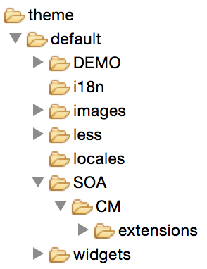
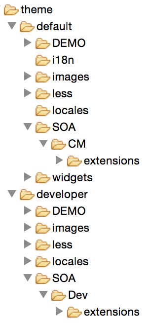
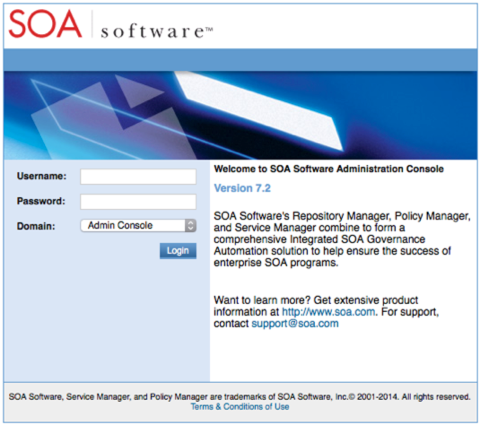
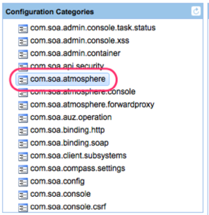
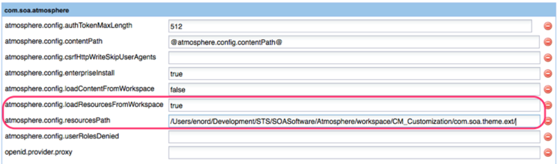
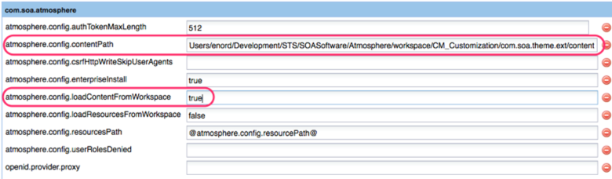
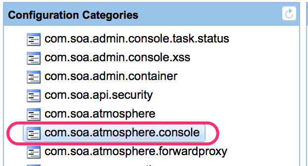

#SOA Software Community Manager&reg; Customization Guide for verison 7.2

| Menu | |
| | link |
  | link |
  | Link | |
|

| Menu          |            | 
| col 3 is      | right-aligned | 
| col 2 is      | centered      |  
| zebra stripes | are neat      |  

##Set-up

###Tools
- Less Compiler
  - [http://incident57/less/](http://incident57/less/)
  - [http://winless.org](http://winless.org)
  
###CMS Deployment Package
All user interface artifacts are packaged into a zip file (with the root "/theme/default/" or "/theme/developer") and updated via default theme user interface using the file upload facility (typically Administration -> Config -> Resources -> Resources).  The file structure of the package is described in the diagram below: 
  
If customization is required in both the default and simpledev themes, the file structure will look like the following: 
  

Each file can be uploaded into the CMS individually.  This is a good process when the developer is only working on a single file or script.  Most likely the developer will be working on multiple files at the same time.  The recommended upload process would be taking advantage of uploading an archive file (zip).  Everything below the theme directory, including the theme directory, needs to be archived.

This can be performed following the proper directions for the proper platform that is being developed on.  Following these instructions:

- Windows: 
    - Locate the theme directory for Windows Explorer
    - Right click on the directory and select
-  Mac:
    -  GUI:
        -  Locate the theme directory from Finder
        -  Right click on the directory and select archive.
        -  Rename the new archive to theme.zip
    -  Console
        - From the terminal, cd to the parent company of theme
        - Run the following command: 'zip -r theme.zip theme/*'
- Linux:
    - Change directory to the theme parent directory
    - The the following command: 'zip -r theme.zip theme/*'

###Local Workspace Usage
During the development process of customizing the user portal, many different files are create or overridden.  During this process, all changes need to be uploaded into the portal to validate correctness.  If a breaking change is uploaded to the portal, it could possible make the portal unusable.  To back out of this, the developer would be required to delete the customization using the API framework.

To prevent this, the developer has an option of loading all customized files from the local workspace.  This does require that either the developer is running the CM portal locally, or the remote server has mapped the developers workstation file system.  Once this configuration is enabled, the ability to recover from a bad configuration, would be to just update the broken change locally.

1. Log into the Policy Manager Administration console
	- https://\<hostname>:<port>/admin
	- Username: \<username>, default is administrator
	- Password: \<password>, default is password 

- Select the configuration tab
- Select the category ‘com.soa.atmosphere’ 

- For resources:
	- Change atmosphere.config.loadResourcesFromWorkspace to true
	- Change atmosphere.config.resourcePath to the root directory of the local resources project. 
So, if the project path is ‘/foo/resources/theme/default/…’, you would enter ‘foo’ into this directory. 

- For content:
	- Change atmosphere.config.loadContentFromWorkspace to true
	- Change atmosphere.config.contentPath to the root directory of the local content project 

- Click the ‘Apply Changes’ button.

Now you should be able to make changes to your local workspace and see those changes appear in the atmosphere portal.

###Atmosphere in Development Mode
During development, it may be required to debug Javascript.  The browser development tools offers this ability.  The atmosphere (CM) portal needs to be configured to allow this.  Otherwise, all of the Javascript gets optimized into a single javascript file.  To enable development, follow these directions:

1. Log into the Policy Manager Administration console
	- https://\<hostname>:<port>/admin
	- Username: \<username>, default is administrator
	- Password: \<password>, default is password 

- Select the configuration tab
- Select the category com.soa.atmosphere 

- Change 'atmosphere.console.config.stealEnvironment' from 'production' to 'development' |