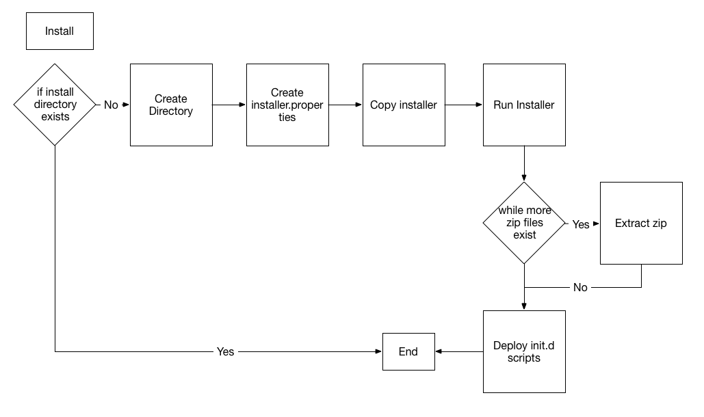
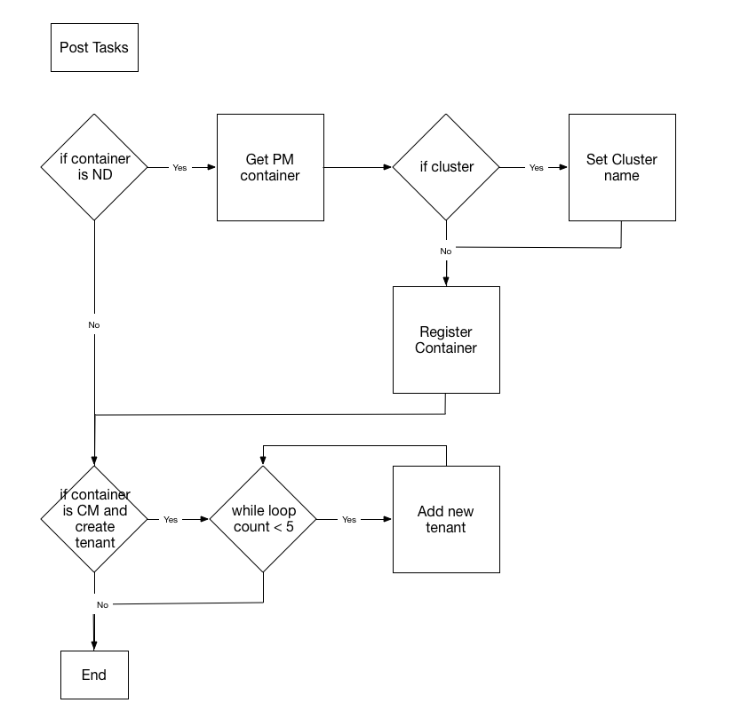

# Akana Automated Software Deployment

## Demo Recording

https://my.soa.com/personal/enord/Documents/Shared%20with%20Everyone/AutomationDemo.mp4

https://my.soa.com/personal/enord/Documents/Shared%20with%20Everyone/AutomationDemo.arf

## SVN
Distribution: http://svn.soa.local/ps/branches/components-7.xx/automation/com.soa.pso.automation.jython/dist/pso-automation_7.2.zip

Source: http://svn.soa.local/ps/branches/components-7.xx/automation/com.soa.pso.automation.jython/

## Installer Script
To run installer
* Download and copy the appropriate files to server (/tmp/install)
* cd <extracted location>/install
* Extract pso-automation.<version>_<date>.zip somewhere (unzip pso-automation.<version>_<date>.zip)
* chmod +x installer.py
* vi(or favorite editor) properties/installer.properties
* Update as needed
 * resources
 * key (license)
* add appropriate environment and container property files to properties directory
* run ./installer.py -i -s -c -v > createContainers.log
 * -i install
 * -s deploy scripts
 * -c create containers
 * -v verbose

### Main


### Install Base


### Install Scripts


## Container Script
To run container as standalone
* cd <install dir>/sm70/scripts/properties
* Update all property files correctly.  Delete the ones you don't want to create
* cd ..
* export JAVA_HOME=<install dir>/sm70/jre
* export JYTHON_HOME=<install dir>/sm70/scripts
* run ../bin/jython.sh containerManager.py -c -v > createContainers.log
 * -c create containers
 * -u update containers
 * -v verbose

### Create Container


#### Build Database
The _Create Container_ process can also build the Policy Manager database. This processing is controlled by the properties in the `[DatabaseSection]` part of the _Installer Property File_ shown below.
The scripted database build process is divided into two parts just like the database processing in the Admin Console:
1. **Database Create Task** is the equivalent of the "Create new database" option in Admin console. If the database already exists, it will be replaced with a new, empty database.
2. **Schema Management Task** populates the database with the tables and data needed by the selected features.

The database build process scans all of the OSGi bundles in the `sm70/lib` directory tree to locate the scripts and controls needed by these two tasks. It does not depend on anything in the `sm70/dbscripts` directory tree.
 
The database build Jython scripts included in the Automated Deployment package are designed so they can be easily used in the future to provide additional automation such as:
* Changing the database connect string or username and password
* Applying database updates
* Installing additional features in a container that include database scripts

#### Post Tasks
Post tasks consist of specific tasks that performed on a container after the container has been started.  These are tasks that are specific to either an ND or CM container.


#### Hardening Tasks
These tasks are the implementation of the [Hardening 2.0](http://docs.akana.com/sp/platform-hardening_2.0.html) recommendations.


#### Performance Tasks
These tasks are the implementation of the [Performance](http://docs.akana.com/sp/performance-tuning.html) recommendations.


#### Container Features
Install the proper features
* Standalone PM
 * policy.manager.console
 * policy.manager.services
 * security.services

* PM with CM
 * Install Standalone PM
 * community.manager
 * community.manager.default.theme
 * community.manager.openid.provider
 * community.manager.scheduled.jobs
 * community.manager.simple.developer.theme (If using SimpleDev)

* PM with CM and OAuth
 * Install PM with CM
 * community.manager.oauth.provider
 * oauth.provider

* PM with remote CM
 * Install Standalone PM
 * community.manager.scheduled.jobs
 * community.manager.plugin
 * community.manager.policy.console

* Standalone CM
 * community.manager.apis
 * community.manager.default.theme
 * community.manager.openid.provider
 * community.manager.simple.developer.theme (If using SimpleDev)

* Standalone CM with OAuth
 * Install Standalone CM
 * community.manager.oauth.provider
 * oauth.provider

* Standalone ND
 * network.director
 * api.security.policy.handler

* Standalone ND with OAuth
 * Install Standalone ND
 * community.manager.oauth.provider.agent
 * oauth.provider.agent

* Standalone OAuth
 * community.manager.oauth.provider
 * oauth.provider
 * community.manager.plugin

* Ping Support
 * For CM
  * ping.federate.integration
 * For ND
  * ping.support

* LaaS Support
 * For CM nodes only
  * community.manager.laas
    
* Add Monitoring to any container
 * admin.monitoring.tool

* Optional Features
 * Site Minder
  * sitemider
  * siteminder.ui
 * SAML WebSSO
  * saml2.sso
  * saml2.sso.ui
 * Development Services
  * devservices
 * Policy Manager for IBM WebSphere DataPower
  * pm.custom.policy
  * pm.websphere.mq
  * pmdp
  * pmdp.slave.node
  * pmdp.console.policy
  * pmdp.malicious.pattern
  * pmdp.oauth
  * pmdp.schema.update

### Update Features
        
## Property Files

### Installer Property File
```
 [InstallSection]
; install.path and resources.location must be absolute
install.path=/opt/soa_sw/
resources.location=/tmp/resources/
install.executable=Linux-pm-7.2.388-setup64.bin
features=<Update with all desired add on features>
; This sets the IATEMPDIR
temp.directory=/tmp
; Populate with the license key
key=
; For windows installs, this creates the short cut
shortcut=
```
### Environment Property File
A single environment property file is required for a given server build out.  These are properties that will be shared across all containers that exist on a given server.  Currently, support building database properties for MySQL and MSSQL.
```
[InstallSection]
install.path=/opt/soa_sw/

[DatabaseSection]
database.create=false
; if database create and the database already exist, what should we do
database.recreate=false
; Check the required schemas
database.pm=true
database.cm=true
database.oauth=true
database.laas=false
database.upgrade52=false
database.pmdp=false
database.wcf=false
database.ims=false
;   Specify the configuration values for this database
;       key       |restrict | description         
;   -------------+---------+--------------------------------------------------
;   databaseType |         | 'mssql', 'mysql', 'oracle', 'oracle-sn', 'db2'
;   user         |         | Database connect userid
;   password     |         | Plain-text password for that user
;   server       |         | Database host name
;   port         |         | Database port
;   database     |         | Name of the database (tablespace for oracle*)
;   instance     | mssql   | MS SQL Server "instance name"
;   instanceName | oracle* | Oracle SID or Service Name (for oracle-sn)
;   tablespace   | db2     | DB/2 Table Space name
;   bufferName   | db2     | DB/2 Buffer Pool
;   isNewBuffer  | db2     | flag to create a new Buffer Pool
;   maxPoolSize  |         | Maximum number of database connections
;   minPoolSize  |         | Minimum number of open, idle connections
;   maxWait      |         | Maximum time to wait for an available connection
;   -------------+---------+--------------------------------------------------
; Common Properties
database.type=
database.user=
database.password=
database.admin=
database.admin.password=
database.host=
database.port=
; For oracle use the tablespace
database.name=
database.max.pool.size=30
database.min.pool.size=3
database.max.wait=30000
database.jar=<required database jar file>
; mssql/oracle specific, only populate for mssql or oracle
database.instance.name=
; db2 specific, only populate for db2
database.tablespace=
database.bufferName=
database.isNewBuffer=

[ProxySection]
proxy.url=
proxy=
proxy.user=
proxy.password=
```

### Container Property Files
A uniquely named container file should be provided for every container that needs to be built and configured for a specific environment.  So, if a PM and ND nodes are needed an a single host, it would be required for 2 uniquely named container property files.

For a secured container, include the secured flag as true.  If custom certificates are needed, provide 2 different custom keystores.  The first keystore would be used for the container that is being built.  The trusted keystore will be used to add a certificate to the cacert file for any containers that this container needs to interact with.  At the same time, the `com.soa.security` category will be appropriately updated and the crl flag will be set to false in the `com.soa.crl` category.

Only container required fields are needed in a properties file.  The automation allows property fields to be omitted.  The following lists what is required based off of the container type:
+ All Containers
    * Common Properties section
    * Features section
    * Plugin section
    * Tool section
    * Configuration Files section (specific properties depends on container type)
        - database.configure
        - proxy.filename
        - route.definitions
    * Hardening Section 
        - container.harden
        - if container.harden is true
            + harden.ignoreCookies
            + harden.secureCookies
            + harden.cipherSuites
            + harden.enabledProtocols
            + harden.cache.expirationPeriod
            + harden.cache.refreshTime
    * Performance Section
        - container.performance
        - if container.performance is true all properties are required
+ CM Only
    * Tenant Properties section
    * Hardening Section
        - if container.harden is true
            + harden.cm.interceptor.blocked
            + harden.cm.allowed.hosts
            + harden.cm.csrf.enabled
            + harden.cm.exception.urls
            + harden.cm.keywords
            + harden.cm.validate
            + harden.cm.x.frame
+ ND Only
    * Configuration Files section
        - wsmex.address
        - org=uddi:soa.com:registryorganization
        - cluster
        - remote.writer.enabled
    * Hardening Section
        - if container.harden is true
            + harden.nd.interceptor.blocked
            + harden.nd.replace.host
            + harden.nd.security.expiration.period
            + harden.nd.security.refresh.time

```
[CommonProperties]
container.name=pm
container.host=0.0.0.0
container.port=9900
container.admin.port=8900
container.admin.user=administrator
container.admin.password=password
container.secure=false
container.secure.keystore=
container.secure.storepass=
container.secure.alias=
container.secure.trusted.keystore=
container.secure.trusted.storepass=
container.secure.trusted.alias=

[FeaturesSection]
agent.foundation=false
community.manager=false
community.manager.apis=false
community.manager.default.theme=false
community.manager.oauth.provider=false
community.manager.oauth.provider.agent=false
community.manager.openid.provider=false
community.manager.scheduled.jobs=false
community.manager.simple.developer.theme=false
delegate=false
delegate.access.point=false
development.services.feature=false
managed.services=false
network.director=false
oauth.provider=false
oauth.provider.agent=false
ping.support=false
policy.manager.console=true
policy.manager.services=true
scheduled.jobs=false
security.services=false
tomcat.agent=false

[PluginSection]
api.security.policy.handler=false
cluster.support=false
community.manager.plugin=true
community.manager.policy.console=true
external.keystore.feature=false
kerberos.implementation=false
community.manager.laas=false
ping.federate.integration=false

[ToolSection]
72.upgrade=false
admin.monitoring.tool=true

[OptionPacks]
; include if siteminder is required
sitemider=false
siteminder.ui=false
site.minder.path=
; include is configuring SAML authentication
saml2.sso=false
saml2.sso.ui=false
; include for Development Services
devservices=false
; PMDP Features
pm.custom.policy=false
pm.websphere.mq=false
pmdp=false
pmdp.slave.node=false
pmdp.console.policy=false
pmdp.malicious.pattern=false
pmdp.oauth=false
pmdp.schema.update=false

[ConfigurationFiles]
database.configure=true
proxy.filename=
; used to route containers through load balancer when needed
; Format needs to be the following '<routes><route><filename>com.soa.http.route-pm1.cfg</filename><pattern>http://pm.host.com:9900/*</pattern><url>http://lb.host.com</url></route></routes>'
; Needed when routing requests back through a load balance: https://support.soa.com/support/index.php?_m=knowledgebase&_a=viewarticle&kbarticleid=607
route.definitions=

; ND specific properties
; just the address to pm like http://<hostname>:<port>
wsmex.address=
; org needs to be a valid uddi key (Change if container needs to be in a different organization)
; Change if ND is required to be under a different organization
org=uddi:soa.com:registryorganization
cluster=
; disable the remote usage writer in ND containers
remote.writer.enabled=true

[TenantProperties]
; CM specific properties
atmosphere.context.root=
; users configured in community manager
atmosphere.config.userRolesDenied=
tenant.url=http://localhost:9900 
tenant.name=EnterpriseAPI 
tenant.id=enterpriseapi
tenant.address=http://localhost:9900 
tenant.console.address=http://localhost:9900/enterpriseapi 
tenant.theme=default 
tenant.admin.email=admin@open 
tenant.admin.password=password 
tenant.contact.email.address=no-reply@open 
tenant.from.email.address=no-reply@open
tenant.virtual.hosts=
;Added 7.2.8
tenant.create=false

[HardeningProperties]
; Hardening properties are set to recommended values.  Change if desired.  For details review: http://docs.akana.com/sp/platform-hardening.html
container.harden=true
harden.ignoreCookies=ignoreCookies
harden.secureCookies=true
harden.cipherSuites=SSL_RSA_WITH_RC4_128_MD5,SSL_RSA_WITH_RC4_128_SHA,TLS_RSA_WITH_AES_128_CBC_SHA,TLS_DHE_DSS_WITH_AES_128_CBC_SHA,SSL_RSA_WITH_3DES_EDE_CBC_SHA,SSL_DHE_DSS_WITH_3DES_EDE_CBC_SHA
harden.cache.expirationPeriod=3600000
harden.cache.refreshTime=300000
; only configured on ND containers
harden.nd.interceptor.blocked=content-type,content-length,content-range,content-md5,host,expect,keep-alive,connection,transfer-encoding,atmo-forward-to,atmo-forwarded-from
harden.nd.template=replace=X-Forwarded-Host:{host}
; only configured on CM Containers
harden.cm.interceptor.blocked=content-type,content-length,content-range,content-md5,host,expect,keep-alive,connection,transfer-encoding
harden.cm.template=
;Added 7.2.8 (Hardening 2.0)
harden.enabledProtocols=SSLv2HELLO,TLSv1,TLSv1.1, TLSv1.2
harden.nd.replace.host={host}
harden.nd.security.expiration.period=3600000
harden.nd.security.refresh.time=300000
harden.cm.allowed.hosts==<Network Director Host(s) and/or Load Balancer host>
harden.cm.csrf.enabled=true
harden.cm.exception.urls=[COMMA DELIMITED LIST]
harden.cm.keywords=[COMMA DELIMITED LIST]
harden.cm.validate=[true|false]
harden.cm.x.frame=[DESIRED HEADER]

[PerformanceProperties]
; Performance properties need to be set appropriately for your desired results.  Values currently set are for examples only.
;    For details review: http://docs.akana.com/sp/performance-tuning.html
container.performance=true
performance.connection.maxTotal=2000
performance.connection.defaultMaxPerRoute=1500
performance.loadGifMetrics=false
performance.performAutoSearch=true
performance.requireMetricsPolicy=true
performance.failureDataCaptureEnabled=true
; ND containers to controll the usage writer
performance.queueCapacity=10000
performance.usageBatchSize=50
performance.writeInterval=1000
performance.preloadInvokedServices=true
performance.framework.idleExpiration=259200
performance.framework.makeFreshInterval=900
performance.endpoint.allowRemoval=false
performance.endpoint.expirationInterval=3600000
performance.endpoint.maxrefreshInterval=900000
```

#### Example Container Files

[Stand alone PM Container](1_pmcontainer.properties)

[Stand alone CM/OAuth Container](2_cmcontainer.properties)

[Stand alone ND Container](3_ndcontainer.properties)

## Release Notes
### 7.2_06252015
- Added support for all database schemas.
    The following schemas are now supported to me dynamically created from the automation framework.
    - PM
    - CM
    - OAUTH
    - LAAS
    - Upgrade52
    - PMDP
    - WCF
    - IMS
- Added support for site minder.
    The ability to dynamically install and configure the Site Minder functionality.  It is required to have the Site Minder Web Agent installed prior to running the automation.

    When running the installer include the Site Minder features that can be downloaded from the Akana Support site.

    Include (at least) the following properties in the container properties file:

```
        [OptionPacks]
        ; include if siteminder is required
        sitemider=false
        siteminder.ui=false
        site.minder.path=<path to the site minder installation>
```
- Added support for SAML WebSSO.
    The ability to dynamically install and configure the SAML WebSSO functionality.  The feature pack must be included in the installer, which can be downloaded from the Akana support site.

    Include (at least) the following properties in the container properties file that requires this feature:

```
        [OptionPacks]
        ; include is configuring SAML authentication
        saml2.sso=false
        saml2.sso.ui=false
```
- Only container required fields are needed in a properties file.
    The automation now allows property fields to be omitted.  The following lists what is required based off of the container type:
    - All Containers
        + Common Properties section
        + Features section
        + Plugin section
        + Tool section
        + Configuration Files section (specific properties depends on container type)
            * database.configure
            * proxy.filename
            * route.definitions
        + Hardening Section 
            * container.harden
            * if container.harden is true
                - harden.ignoreCookies
                - harden.secureCookies
                - harden.cipherSuites
                - harden.enabledProtocols
                - harden.cache.expirationPeriod
                - harden.cache.refreshTime
        + Performance Section
            * container.performance
            * if container.performance is true all properties are required
    - CM Only
        + Tenant Properties section
        + Hardening Section
            * if container.harden is true
                - harden.cm.interceptor.blocked
                - harden.cm.allowed.hosts
                - harden.cm.csrf.enabled
                - harden.cm.exception.urls
                - harden.cm.keywords
                - harden.cm.validate
                - harden.cm.x.frame
    - ND Only
        + Configuration Files section
            * wsmex.address
            * org=uddi:soa.com:registryorganization
            * cluster
            * remote.writer.enabled
        + Hardening Section
            * if container.harden is true
                - harden.nd.interceptor.blocked
                - harden.nd.replace.host
                - harden.nd.security.expiration.period
                - harden.nd.security.refresh.time

## Todo 
### Tasks
* Test
    - Windows
    - DB2
* PMDP container creation
    
### Issues
* Configurator still running